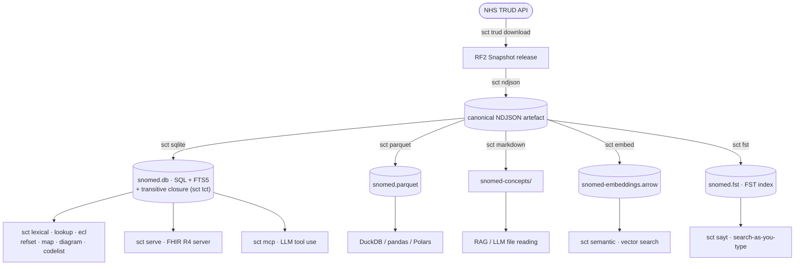

# sct

A local-first SNOMED CT toolchain that's 10-100x faster than IHTSDO Snowstorm. One binary - from raw RF2 release to NDJSON, then SQL, Parquet, Markdown, TUI, GUI, graphs and MCP/LLM tool use. All on your machine, no network calls, REST APIs, or external servers required.

This is very much a work in progress, but it's ready to use and I would very much like feedback on how it performs for you.



Plus `sct diff` (compare two NDJSON releases), `sct info` (inspect any artefact),
and `sct gui` / `sct tui` for visual, point-and-click exploration.

The NDJSON artefact at the centre is a stable, versionable, greppable file. All other outputs are derived from it and can be regenerated at any time.

---

## Why is this needed?

`sct` joins the relatively incomprehensible RF2 files into a single NDJSON artefact. For the UK Monolith Edition this NDJSON file is over 1Gb but it was still possible to load into VSCode to get a feel for the data structure, which is something that is impossible with the original RF2 files. This also means you can use standard tools like `jq` or `ripgrep` to query the data without needing a custom server or API.

SNOMED CT is distributed as RF2 - a set of tab-separated files that require joining across multiple tables to get anything useful. The entire healthcare industry relies on remote terminology servers for this, with the overhead of network calls and REST APIs. `sct` performs the join once creating an NDJSON artefact, and produces standard files you can query locally with `sqlite3`, `duckdb`, `jq`, `ripgrep`, or an LLM. No server, no API key, no network.

## Speed comparison

| Operation | `sct` + SQLite | Snowstorm Lite | `sct` speedup |
| --- | --- | --- | --- |
| Import - Clinical Edition | 22s | 209s | ~10x faster |
| Import - Full UK Monolith | ~57s | Failed (OOM)* | ∞ |
| Single concept lookup (SCTID) | 6ms | 491ms | ~80x faster |
| Free-text search (10 results) | 2ms | 202ms | ~100x faster |

> * Snowstorm Lite running in Docker with 24Gb of Java heap allocation ran out of memory on the full UK Monolith, which has 837,930 concepts. `sct` handled it in under a minute.

These comparison numbers predate the current 837,930-concept release and haven't been re-run against a live Snowstorm Lite instance since - treat them as indicative rather than current. For up-to-date `sct`-only timings, see [docs/benchmarks.md](docs/benchmarks.md). Feel free to run the benchmarks yourself (including a fresh Snowstorm Lite comparison) and share your results, perhaps as an Issue.

---

## Installation

Prebuilt binaries are published for Linux (x86_64, aarch64), macOS (Apple Silicon, Intel), and Windows (x86_64) on every release, with SHA-256 checksums you can verify against the `SHA256SUMS` file on the [Releases page](https://github.com/pacharanero/sct/releases).

### Shell one-liners

**macOS / Linux:**

```bash
curl -fsSL https://raw.githubusercontent.com/pacharanero/sct/main/install.sh | sh
```

**Windows (PowerShell):**

```powershell
iwr -useb https://raw.githubusercontent.com/pacharanero/sct/main/install.ps1 | iex
```

Both installers auto-detect your OS and architecture, download the matching binary, verify its SHA-256 checksum against the published `SHA256SUMS`, and install to `~/.local/bin` (macOS / Linux) or `%LOCALAPPDATA%\sct\bin` (Windows). Override the destination with `SCT_INSTALL_DIR`, or pin a specific version with `SCT_VERSION=v0.3.9`.

### Homebrew (macOS and Linux)

```bash
brew tap pacharanero/tap
brew install sct
```

### Scoop (Windows)

```powershell
scoop bucket add pacharanero https://github.com/pacharanero/scoop
scoop install sct
```

### Cargo

If you already have a Rust toolchain (via [rustup](https://rustup.rs), stable 1.70+):

```bash
# Compile from crates.io
cargo install sct-rs
```

Or, if you have the [`cargo-binstall`](https://github.com/cargo-bins/cargo-binstall) plugin installed (it is not bundled with `cargo` itself), grab a prebuilt binary instead of compiling from source:

```bash
# One-time: install the binstall plugin (or follow the one-liner installers in its README)
cargo install cargo-binstall

# Then install sct without compilation
cargo binstall sct-rs
```

### Nix

With [Nix](https://nixos.org) and flakes enabled, run `sct` straight from the repository without installing it, add it to your profile, or drop into a dev shell:

```bash
# Run without installing anything
nix run github:pacharanero/sct -- lookup 22298006

# Install into your profile
nix profile install github:pacharanero/sct

# Dev shell with the Rust toolchain, for hacking on sct
nix develop github:pacharanero/sct
```

### Build from source

```bash
git clone https://github.com/pacharanero/sct
cd sct
cargo install --path .                   # default build: core commands + sct serve + sct tui
cargo install --path . --features gui    # add the browser UI (sct gui)
cargo install --path . --features dmwb   # add the NHS DMWB .mdb reader (sct dmwb)
cargo install --path . --features full   # everything: serve + tui + gui + dmwb
```

| Feature | Default? | What it adds | Extra dependencies |
|---|---|---|---|
| `serve` | yes | FHIR R4 terminology server (`sct serve`) | `axum`, `tokio` |
| `tui` | yes | Interactive terminal UI - powers both `sct tui` and the live `sct sayt` view | `ratatui`, `crossterm` |
| `gui` | opt-in | Browser-based graph UI (`sct gui`) | `axum`, `tokio`, `open` |
| `dmwb` | opt-in | Read NHS Data Migration Workbench `.mdb` files (`sct dmwb`) | `jetdb` |
| `full` | opt-in | Everything: `serve` + `tui` + `gui` + `dmwb` | all of the above |

Every other subcommand (RF2 conversion, SQLite/Parquet/Markdown/Arrow, search, ECL, maps, codelists, MCP, diff, info…) is always compiled in. Only a `--no-default-features` build - such as the headless Docker server image - drops `serve` and `tui`.

### Manual download

Grab the appropriate archive from the [Releases page](https://github.com/pacharanero/sct/releases), verify its SHA-256 against `SHA256SUMS`, extract, and drop `sct` somewhere on your `PATH`.

---

## Quick start

```bash
# 1. Download a distribution of SNOMED CT
#    UK:            https://isd.digital.nhs.uk/ → Monolith Edition, RF2: Snapshot
#                   (free under NHS England national licence - access is immediate)
#                   NB: You need to Subscribe to a release before you can see the Download option 🤯
#    International: https://mlds.ihtsdotools.org/ (allow up to a week for approval)

# 2. Convert RF2 → NDJSON (~52s for 837,930 concepts)
#    Pass the .zip directly - no manual extraction needed
sct ndjson --rf2 SnomedCT_MonolithRF2_PRODUCTION_20260311T120000Z.zip
# ✓  837,930 concepts written → snomedct-monolithrf2-production-20260311t120000z.ndjson

# 3. Load into SQLite with FTS5
sct sqlite --ndjson snomedct-monolithrf2-production-20260311t120000z.ndjson

# 4. Query with standard tools - no custom binary needed
sqlite3 snomed.db \
  "SELECT id, preferred_term FROM concepts_fts WHERE concepts_fts MATCH 'heart attack' LIMIT 5"

# 5. Start the MCP server for Claude Desktop
sct mcp --db snomed.db
```

UK users can automate steps 1–3 with a single command once the [TRUD API integration](docs/commands/trud.md) is set up:

```bash
sct trud download --edition uk_monolith --pipeline
```

Or, on a fresh VPS with Docker installed, run the FHIR terminology server from
this checkout - `sct` plus a [Caddy](https://caddyserver.com) reverse proxy for
automatic HTTPS:

```bash
cp .env.example .env
$EDITOR .env   # set TRUD_API_KEY, and DOMAIN for real HTTPS
docker compose up -d --build
```

The first boot downloads the configured TRUD edition, builds `snomed.db` into a
persistent Docker volume, and serves FHIR at `https://$DOMAIN/fhir` (or
`http://localhost/fhir` if `DOMAIN` is left unset). See
[Get Your Own Terminology Server](docs/deploy/index.md) for the full
walkthrough, including optional basic auth and a no-clone route using the
published Docker Hub image.

## Documentation

For all further information see the full documentation by either exploring the [docs/](docs/) directory or running the docs site locally with `s/docs`, or visit the docs on the GitHub Pages site: <https://pacharanero.github.io/sct/>

---

## Subcommands

* [sct trud](docs/commands/trud.md) - download SNOMED CT RF2 releases via the NHS TRUD API
* [sct ndjson](docs/commands/ndjson.md) - convert an RF2 Snapshot directory to a canonical NDJSON artefact
* [sct sqlite](docs/commands/sqlite.md) - load NDJSON into a SQLite database with FTS5
* [sct tct](docs/commands/tct.md) - build a transitive closure table over the IS-A hierarchy for subsumption-heavy workloads
* [sct parquet](docs/commands/parquet.md) - export NDJSON to a Parquet file for DuckDB / analytics
* [sct markdown](docs/commands/markdown.md) - export NDJSON to per-concept Markdown files (or per-hierarchy with `--mode hierarchy`)
* [sct mcp](docs/commands/mcp.md) - start a local MCP server over stdio backed by the SQLite database
* [sct serve](docs/commands/serve.md) - FHIR R4 terminology server ($lookup/$validate-code/$subsumes/$expand with ECL)
* [sct read2](docs/commands/read2.md) - import final Read v2 maps from NHS Data Migration TRUD item 9
* [sct embed](docs/commands/embed.md) - generate Ollama vector embeddings and write an Arrow IPC file
* [sct lexical](docs/commands/lexical.md) - keyword (FTS5) search over the SQLite database
* [sct fst](docs/commands/fst.md) - mmap'd FST index for exact, prefix, and typo-tolerant **fuzzy** search
* [sct sayt](docs/commands/sayt.md) - **search-as-you-type**: instant offline autocomplete over 800k+ concepts, as an interactive TUI, a `--stdio` line protocol, or an HTTP `/autocomplete` endpoint on `sct serve`
* [sct semantic](docs/commands/semantic.md) - semantic similarity search over the Arrow IPC embeddings file (requires Ollama) - experimental, see the docs for known limitations
* [sct ecl](docs/commands/ecl.md) - evaluate an ECL expression and emit matching concept SCTIDs (pipe-friendly)
* `sct lookup <code>` - look up a concept by SCTID, or reverse-resolve a CTV3 code
* [sct diagram](docs/commands/diagram.md) - draw a concept's definition, ancestors, or descendants as a tree, DOT, or Mermaid diagram
* [sct refset](docs/commands/refset.md) - inspect SNOMED CT simple reference sets loaded into a SQLite database
* [sct map](docs/commands/map.md) - map codes between SNOMED CT, Read v2, CTV3, ICD-10, and OPCS-4: `sct map <code>` shows all cross-terminology equivalents of a single code, `sct map --from read2 --to snomed` maps a stream (`sct trud download --multi-terminology` builds the full workspace). Aliases: `sct transcode`, `sct crosswalk`
* `sct codelist` - build, validate, and publish clinical code lists; `add --ecl "<<73211009"` populates from an ECL query
* `sct info <file>` - inspect any `.ndjson`, `.db`, or `.arrow` artefact and print a summary
* `sct diff --old <file> --new <file>` - compare two NDJSON releases and report what changed
* `sct paths` - show where sct looks for databases, embeddings, and config files
* [sct completions](docs/commands/completions.md) - print shell completion scripts (bash, zsh, fish, powershell, elvish)
* [sct tui](docs/commands/tui.md) - keyboard-driven terminal UI for interactive SNOMED CT exploration *(in the default build)*
* [sct gui](docs/commands/gui.md) - browser-based UI served over localhost for point-and-click exploration *(optional feature)*

Run any subcommand with `--help` for full option reference.

---

## Which output do I want?

| Goal | Command |
|---|---|
| Query with SQL / keyword search | `sct sqlite` then `sct lexical` |
| Analytics / DuckDB | `sct parquet` |
| RAG / LLM file ingestion | `sct markdown` |
| Semantic / meaning-based search | `sct embed` then `sct semantic` |
| Claude Desktop or Claude Code | `sct sqlite` then `sct mcp` |

---

## Getting SNOMED CT

SNOMED CT is licensed. Download the RF2 Snapshot for your region:

* **UK:** [NHS Digital TRUD](https://isd.digital.nhs.uk/) → *SNOMED CT Monolith Edition, RF2: Snapshot*. Covered by the NHS England national licence.
* **International:** [MLDS](https://mlds.ihtsdotools.org/) or [NLM](https://www.nlm.nih.gov/healthit/snomedct/us_edition.html).

Download the **Monolith Snapshot** if available - it bundles the international base, clinical extension, and drug extension in one directory.

---

## Feedback

Please try it out and let me know how it performs for you, especially if you have a use case that isn't well supported by the current subcommands. Open an [Issue](https://github.com/pacharanero/sct/issues) for anything you want to report, from bugs to feature requests to general feedback.

## Development

A [devcontainer](https://containers.dev/) configuration is included in `.devcontainer/`. Open the project in VS Code and select "Reopen in Container" to get a ready-to-go environment with Rust, `sqlite3`, `duckdb`, `jq`, and `ripgrep` pre-installed. Also included is `python3` and Ollama, for working with the embeddings and semantic search features.

Store SNOMED data files (zips, NDJSON, databases) in the `data-volume/` directory inside the container - it's backed by a Docker volume for faster I/O than the default bind mount.

## Contributing

Please see [CONTRIBUTING.md](CONTRIBUTING.md) for guidelines on how to contribute, report issues, or request features.

## Roadmap

See the [ROADMAP](spec/roadmap.md) for planned features, improvements, and long-term vision for the project.

## Trademarks and Copyright

### SNOMED CT®

SNOMED CT® is a registered trademark of SNOMED International. This project is an independent implementation and is not affiliated with SNOMED International. All SNOMED CT data is sourced from the official RF2 releases and remains copyright of SNOMED International. Please refer to the license terms for your use of SNOMED CT data. You must ensure you have an appropriate license to use SNOMED CT data in your jurisdiction.

### `sct`

`sct` is not trademarked. The source code and binaries are copyright Marcus Baw and Baw Medical Ltd, and provided to you under the terms of the AGPL-3.0 license.
